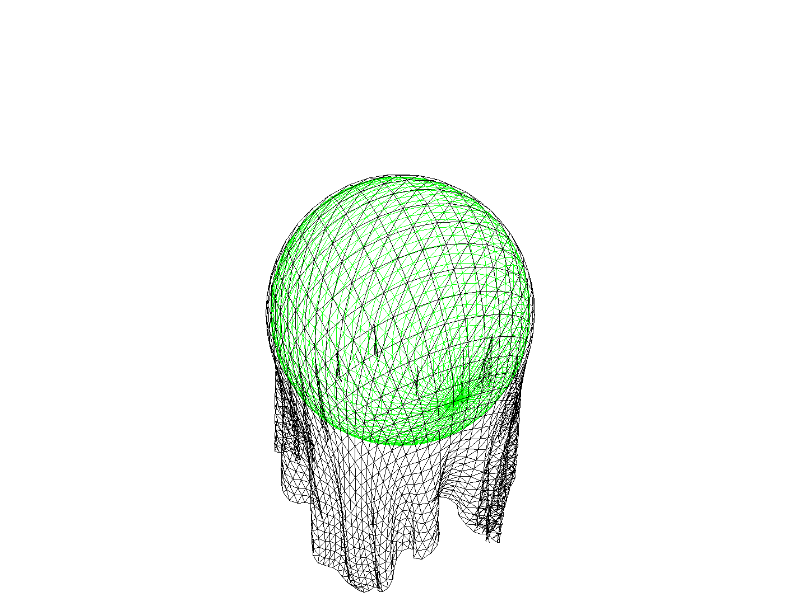

# Cloth Simulation

## Project Overview

This project implements a cloth simulation using Rust and WebGPU. The simulation visualizes the interaction between a cloth and a sphere, where the cloth responds to physical forces like gravity and collisions with the sphere.

 <!-- Add your image path here -->

## Directory Structure

```
cloth_simulation/
    ├── Cargo.lock
    ├── Cargo.toml
    └── src/
        ├── cloth_sim_app.rs
        ├── cloth_sim_compute.wgsl
        ├── main.rs
        ├── shader.wgsl
        └── sim_gen.rs
```

## Dependencies

The project uses several crates and libraries, as defined in the `Cargo.toml`:

- **wgpu-bootstrap**: Provides a bootstrap for setting up a WebGPU environment.
- **wgpu**: WebGPU API bindings for Rust.
- **winit**: Window handling.
- **log** and **env_logger**: Logging utilities.
- **pollster**: Simple futures executor for synchronous blocking.
- **bytemuck**: Provides zero-cost utilities for casting and working with byte data.
- **rand**: Random number generation.
- **futures**: Asynchronous programming in Rust.

## Getting Started

### Prerequisites

- **Rust**: Ensure you have the latest stable version of Rust installed. You can install Rust using [rustup](https://rustup.rs/).
- **Cargo**: The Rust package manager, included with Rust installation.

### Setup

1. **Clone the Repository**

   ```bash
   git clone https://github.com/your-repo/cloth_simulation.git
   cd cloth_simulation
   ```

2. **Build the Project**

   The project can be built using Cargo:

   ```bash
   cargo build
   ```

3. **Run the Simulation**

   To start the cloth simulation, use the following command:

   ```bash
   cargo run
   ```

   This will compile and execute the simulation, opening a window where the cloth and sphere interaction can be observed.

## File Descriptions

- **`Cargo.toml`**: Specifies the dependencies and metadata for the project.
- **`src/cloth_sim_app.rs`**: Contains the main application logic, including the setup of the WebGPU context and the simulation's rendering and compute pipelines.
- **`src/cloth_sim_compute.wgsl`**: WebGPU Shading Language (WGSL) code for the compute shader, handling the physics simulation of the cloth.
- **`src/main.rs`**: Entry point of the application, setting up the runner and initializing the app.
- **`src/shader.wgsl`**: WGSL code for the vertex and fragment shaders, used for rendering the cloth and sphere.
- **`src/sim_gen.rs`**: Utility functions for generating the initial cloth and sphere vertex data.

## Usage and Customization

- **Camera Controls**: Use the mouse to rotate the camera around the scene.
- **Physics Parameters**: Various constants such as `GRAVITY`, `DAMPING`, and `STIFFNESS` in `src/cloth_sim_app.rs` can be adjusted to change the behavior of the simulation.

## Troubleshooting

If you encounter any issues, make sure your environment meets the prerequisites and that all dependencies are correctly installed. You can check for updates to dependencies in `Cargo.toml` and ensure compatibility.

## Acknowledgements

Special thanks to the contributors of the Rust WebGPU ecosystem and the community for providing essential libraries and support.

---

Feel free to contribute to this project by opening issues or submitting pull requests. Happy coding!
